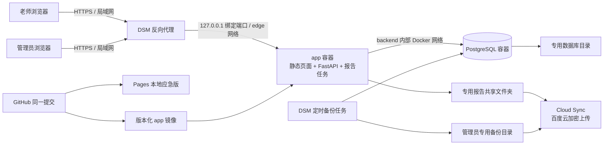

# 科创诊断报告生成器 NAS 集中化部署设计

**状态：** 已完成交互式架构确认，等待书面审阅  
**日期：** 2026-08-25  
**适用仓库：** `innovation-diagnostic-report-generator`

## 1. 背景

当前应用是一个静态 HTML 页面，数据、批次、学生记录及 AI 配置保存在浏览器 `localStorage` 中。页面已经通过 GitHub Pages 发布，适合作为单机使用和紧急情况下的降级入口，但无法满足工坊正式使用时的集中登录、共享记录、审计、回收站和 NAS 文件归档要求。

正式系统部署到 Synology DS220+。该 NAS 为 x86_64，DSM 的 Container Manager、Docker Engine 和独立的 `docker-compose` 命令已经通过实机验证。系统实际识别约 9.6 GiB 内存，当前可用资源足以运行一个轻量应用容器和一个 PostgreSQL 容器。

由于 NAS 同时保存公司资料，本设计把隔离、最小权限、可恢复性和人工可控更新置于功能便利性之前。

## 2. 目标

### 2.1 业务目标

- 每位老师使用独立账号登录。
- 所有老师可查看、搜索和修改所有业务记录。
- 老师可将记录移入回收站并恢复。
- 只有管理员可永久删除记录。
- 管理员可管理账号、查看全部操作审计和执行维护操作。
- 使用记录、修改历史、生成历史和正式业务数据集中保存在 NAS。
- PDF/PNG 报告在应用中可下载，也能通过 File Station 按人类可读目录查看。
- 保留现有 HTML 的报告命名规则。
- 老师继续自行填写 AI API 配置，系统不提供公共额度，也不集中保存 API Key。

### 2.2 交付与恢复目标

- GitHub 仓库是唯一源码事实源。
- 同一个提交和版本号同时产生 GitHub Pages 应急版与 NAS 正式版。
- GitHub Pages 在 NAS 不可用时仍能以浏览器本地模式工作。
- NAS 更新失败时可回滚到上一应用镜像。
- NAS 数据依靠本机保护与百度云异地加密副本恢复，GitHub 不承担数据备份职责。

## 3. 非目标

- 不通过 QuickConnect 对外发布本业务应用；QuickConnect 只用于 DSM 管理。
- 不实现 GitHub Pages 与 NAS 数据库的实时或双向同步。
- 不把 PostgreSQL 数据、学生记录、报告文件、密码或密钥提交到 GitHub。
- 不在第一阶段引入 Nginx、Redis、Celery、独立任务工作器或 Watchtower。
- 不实现多机构租户、复杂部门权限或多人实时协同编辑。
- 不提供管理员代管的公共 AI API Key。
- 不自动永久删除业务记录或云端备份。

## 4. 总体架构



### 4.1 两容器基线

1. `app`
   - 提供静态前端、FastAPI API、会话校验、数据库访问和低并发报告生成。
   - 报告队列并发固定为 1，避免 DS220+ CPU 和内存瞬时占用过高。
   - 使用 ReportLab/Pillow 的纯 Python 报告生成链路，不在 NAS 中引入 Chromium/Playwright。

2. `db`
   - 运行 PostgreSQL。
   - 只加入项目内部 Docker 网络，不发布宿主机端口。
   - 数据写入专用持久化目录。

DSM 反向代理承担 TLS 终止和入口转发，因此不再增加 Nginx 容器。

### 4.2 资源预算

- `app`：内存上限约 1.5 GiB；DS220+ 的 cgroup v1 未暴露 CFS quota/period，因此不用 Compose `cpus`，改为固定 `cpuset: "1"`、保守 `cpu_shares` 和 `ulimits.nproc` 进程数上限。
- `db`：内存上限约 2 GiB；固定 `cpuset: "0"`、保守 `cpu_shares` 和 `ulimits.nproc`，连接池保持小规模。
- 报告任务：单任务执行，禁止无界队列和并行图片渲染。
- 容器总预算不得挤占 DSM 文件服务和公司现有业务所需资源。

以上是安全上限而非预留占用；容器按实际使用量消耗资源。上线后根据 DSM 资源监控再做下调，不因未来可能出现的新业务提前增加服务。

## 5. GitHub Pages 与 NAS 双模式

### 5.1 共享源码

- 前端业务逻辑、表单结构、校验规则、报告模板和命名函数位于同一仓库。
- 发布使用不可变版本号和 Git 提交号。
- 页面页脚或管理信息区显示当前版本和提交号。

### 5.2 Pages 应急模式

- `storageMode=local`。
- 无账号系统，数据继续保存在当前浏览器 `localStorage`。
- AI API Key 由当前用户输入并只保存在当前浏览器。
- 支持导出应急 JSON，供 NAS 恢复后由管理员人工导入。
- 不连接 NAS API，不持有 NAS 地址、Cookie、数据库密码或其他秘密。

### 5.3 NAS 正式模式

- `storageMode=api`。
- 所有业务读写通过鉴权 API 进入 PostgreSQL。
- 浏览器不得把正式业务数据库的完整副本持久化到 `localStorage`。
- 可以保留必要的非敏感 UI 偏好；AI API Key 仍只保存在老师自己的浏览器，不进入数据库、日志、审计或备份。

### 5.4 应急数据回收

- Pages 产生的应急 JSON 只能由管理员在 NAS 中执行“预览、确认、导入”。
- 导入前显示新增、重复和冲突数量。
- 每次导入保存文件 SHA-256、操作者、时间和结果摘要。
- 不做自动双向合并，避免旧浏览器数据覆盖 NAS 正式数据。

## 6. 身份、权限与会话

### 6.1 角色

| 操作 | 老师 | 管理员 |
| --- | --- | --- |
| 查看全部记录 | 允许 | 允许 |
| 新增和修改记录 | 允许 | 允许 |
| 查看生成历史 | 允许 | 允许 |
| 移入回收站 | 允许 | 允许 |
| 从回收站恢复 | 允许 | 允许 |
| 永久删除 | 禁止 | 允许，必须填写原因 |
| 管理账号 | 禁止 | 允许 |
| 查看完整审计 | 禁止 | 允许 |
| 执行备份、恢复和升级 | 禁止 | 允许 |

### 6.2 账号与会话安全

- 使用应用自身账号，不复用 DSM 管理员账号。
- 密码只保存强密码哈希，不保存明文或可逆密文。
- 登录使用 `HttpOnly`、`Secure`、`SameSite` Cookie，会话有空闲和绝对有效期。
- 所有状态修改请求执行 CSRF 防护。
- 登录失败进行速率限制和短时锁定；审计失败事件但不记录密码。
- 初始管理员通过一次性本机引导命令创建，初始凭据不得进入镜像、Compose 或 Git。
- 管理员禁用账号后，该账号现有会话立即失效。

## 7. 数据模型与并发控制

### 7.1 主要实体

- `users`：账号、显示名、角色、状态、密码哈希、最近登录时间。
- `sessions`：会话摘要、用户、创建/失效时间；不保存原始 Cookie 值。
- `batches`：体验日期、批次名称和创建信息。
- `students`：可见姓名、年级、班级等可查询字段。
- `evaluations`：当前表单正文、`schema_version`、版本号和软删除状态。
- `evaluation_versions`：每次有效修改后的不可变快照、操作者和修改时间。
- `generation_records`：报告生成状态、输入快照、文件元数据和生成器版本。
- `audit_events`：登录、查看敏感管理页、增删改、恢复、永久删除、导入、生成和维护操作。
- `emergency_imports`：Pages 应急 JSON 的文件摘要和导入结果。

### 7.2 可搜索设计

- UUID 只作为内部主键和文件映射键，不作为老师定位学生的方式。
- 姓名、年级、班级、日期、批次、创建者、生成状态和回收站状态使用独立字段并建立索引。
- 表单中变化较快的内容使用带 `schema_version` 的 JSONB 保存。
- 全局搜索支持中文姓名片段，并可结合日期、批次、年级、班级、创建者、生成状态和回收站过滤。

### 7.3 修改冲突

- 每条当前记录包含递增 `version`。
- 保存时客户端必须提交它最后读取的版本。
- 版本已变化时 API 返回 `409 Conflict`，页面展示“他人已修改”的对比或重新加载入口。
- 禁止后提交者静默覆盖先提交者。
- 自动保存必须显示“保存中、已保存、保存失败、存在冲突”状态。

### 7.4 删除与审计

- 老师删除只设置软删除字段并写入审计。
- 恢复清除软删除状态并写入审计。
- 永久删除只允许管理员执行，必须再次确认并填写原因。
- 永久删除后保留不含学生正文的审计墓碑，用于证明谁在何时删除了哪一个内部记录。
- “永久删除”指从在线数据库和 File Station 正式目录移除；历史加密备份可能在其保留期内继续包含旧副本。执行前必须向管理员明确提示这一边界。
- 普通应用数据库角色不得更新或删除 `audit_events`；审计清理由独立维护流程控制。
- 第一阶段不自动清空回收站或永久删除报告。

## 8. 页面与工作流

### 8.1 NAS 正式版新增界面

- 登录页。
- 全局记录列表与组合搜索。
- 当前表单编辑页，尽量保持现有布局和填写体验。
- 版本冲突提示和修改历史入口。
- 报告生成状态与生成历史。
- 回收站。
- 管理员账号管理、审计、导入、备份状态和版本信息。

### 8.2 AI 润色

- 每位老师自行填写 API Key、兼容端点和模型。
- API Key 仅存储在当前浏览器，不进入 NAS 数据库。
- 默认由浏览器直接调用兼容 OpenAI 格式的提供方接口。
- 审计只记录操作者、时间、记录 ID、提供方主机名、模型、成功或失败，不记录 API Key。
- 第一阶段不建设 NAS AI 代理，不提供公共额度，也不设置每日 100 次的集中配额。

## 9. 报告生成与文件命名

### 9.1 生成条件和流程

- 只有通过必填校验的记录才能生成正式报告。
- 创建生成任务时保存不可变输入 JSON 快照和生成器版本。
- `app` 内部队列按并发 1 执行；重启后重新领取未完成任务。
- 每次生成均创建新的 `generation_id`，禁止覆盖历史生成结果。
- 单个任务失败最多自动重试 2 次；之后保留错误摘要并允许人工重试。
- 文件先写临时名，完成校验后原子重命名，避免 File Station 看到半成品。
- 每个文件记录 SHA-256、大小、MIME、相对路径和生成器版本。

### 9.2 输出集合

当内部区块启用时，每次生成四个文件：

1. 家长版 PDF（无内联）
2. 家长版 PNG（无内联）
3. 内部版 PDF（含内联）
4. 内部版 PNG（含内联）

内部版增加清晰水印或标识，避免误发给家长。

### 9.3 命名兼容

严格复用现有 HTML `_filename` 规则：

- 默认模板：`{name}_{date}_科创体验报告`
- 家长版后缀：`_无内联`
- 内部版后缀：`_含内联`
- 去除 `\\ / : * ? " < > |`
- 结果为空时回退为 `科创体验报告`
- 保留可配置的 `filenamePattern`

示例：

- `张三_8月25日_科创体验报告_无内联.pdf`
- `张三_8月25日_科创体验报告_无内联.png`
- `张三_8月25日_科创体验报告_含内联.pdf`
- `张三_8月25日_科创体验报告_含内联.png`

## 10. File Station 结构与权限

### 10.1 共享文件夹

- 建立专用加密共享文件夹 `科创诊断报告`，不得复用公司资料共享目录。
- `app` 专用 DSM 服务账号拥有读写权限。
- 老师组只有读取和下载权限。
- 管理员组拥有维护权限。
- 其他 DSM 账号默认无权限。
- 老师不得通过 File Station 上传、重命名、修改或删除；所有业务变更均从应用进入审计链。

### 10.2 人类可读路径

```text
科创诊断报告/
  2026年/
    08月/
      2026-08-25_批次1/
        张三/
          19-32-05/
            张三_8月25日_科创体验报告_无内联.pdf
            张三_8月25日_科创体验报告_无内联.png
            张三_8月25日_科创体验报告_含内联.pdf
            张三_8月25日_科创体验报告_含内联.png
```

- 学生目录和批次目录同样执行路径字符清理、长度限制和目录穿越防护。
- 同一秒重复生成时，只给时间目录追加 `-2`、`-3`，不修改已确认的报告文件名规则。
- 数据库保存 `student_id`、`generation_id`、显示名称、相对路径和 SHA-256 的对应关系。
- 数据库原始目录、备份、快照和秘密不得暴露给老师的 File Station 共享目录。

## 11. NAS 与容器安全

### 11.1 网络边界

- 应用仅由 DSM HTTPS 反向代理访问。
- `app` 宿主端口只绑定 `127.0.0.1`。
- PostgreSQL 不映射宿主端口。
- Compose 固定两个网络：`backend` 为内部网络且只有 `app` 与 `db` 加入；`edge` 为普通桥接网络且只有 `app` 加入，用于修复 DS220+ 上全内部网络不生成宿主 loopback 端口映射的问题，并保留受控出站 AI 调用能力。
- DSM 防火墙只允许工坊局域网访问业务入口。
- QuickConnect 不代理本业务应用。

### 11.2 容器最小权限

- `app` 使用非 root 用户和只读根文件系统。
- 设置 `no-new-privileges`、`cap_drop: ALL`、进程数和资源上限。
- 只挂载专用报告目录和必要的临时目录。
- 不使用 `privileged`、`host` 网络、Docker Socket、硬件设备或公司共享文件夹挂载。
- 临时文件使用受限 `tmpfs`，任务结束后清理。
- PostgreSQL 使用独立内部网络、独立数据目录和最小应用数据库角色。

### 11.3 密钥与日志

- `.env`、数据库密码、会话密钥和 Cloud Sync 解密材料永不进入 Git、镜像或报告目录。
- NAS 上的秘密文件只允许管理员读取。
- 应用日志不记录密码、Cookie、Authorization、API Key 或完整学生表单正文。
- 日志启用大小轮转；异常只记录必要上下文和内部记录 ID。

### 11.4 供应链

- 应用镜像和 PostgreSQL 镜像固定到明确版本和 digest，禁止 `latest`。
- 生产环境不依赖第三方镜像加速地址作为唯一来源。
- 网络不可用时，从可信开发电脑导出镜像并通过 SHA-256 校验后离线导入。
- CI 对依赖和镜像执行漏洞扫描；发现高危问题时阻止正式版本发布。
- 不使用自动更新容器，所有更新均由管理员确认。

## 12. 备份与恢复

### 12.1 低使用量阶段策略

- PostgreSQL 每月生成一次一致性逻辑备份。
- 每次应用升级或数据库结构迁移前强制额外生成一次备份。
- 管理员可随时执行“立即备份”。
- 当月新增记录超过 100 条，或系统成为关键业务后，将策略重新评估为每周或每日。
- 当前策略明确接受：整机故障发生在月末时，数据库最多可能回退约 30 天。

### 12.2 备份内容

- PostgreSQL 使用一致性逻辑备份格式，文件名包含 UTC 时间和应用版本。
- 每份备份附带 SHA-256、数据库 schema 版本、应用版本和生成结果清单。
- 备份由 DSM 任务计划执行管理员专用脚本；脚本和凭据文件只允许管理员读取，密码不得出现在命令行参数或日志中。
- 报告文件作为不可变文件独立同步，不直接复制 PostgreSQL 物理数据目录。
- GitHub 已保存源码和部署模板，备份包不重复包含公开源码。
- `.env` 和密钥不进入云端数据包；恢复密钥由管理员离线保管。

### 12.3 Cloud Sync 到百度云

- 为本项目建立独立任务和路径，不复用公司资料任务目录。
- 任务由专用、非个人 DSM 服务账号持有，避免人员账号停用导致任务失效；该账号只获得本项目备份路径所需权限。
- 使用“仅上传本地更改”。
- 设置“源端删除时不删除目标文件”。
- 对数据库备份、学生数据和 PDF/PNG 开启 Cloud Sync 客户端数据加密。
- 公开源码和不含秘密的部署说明无需通过该任务备份。
- Cloud Sync 加密只影响云端副本；NAS 本地报告仍可在 File Station 正常查看。
- 导出的解密密钥保存两份离线副本，不得放在 NAS、GitHub 或同一百度云账号中。
- 第一阶段不自动清理云端历史副本；管理员每年检查容量。需要清理时必须使用 Cloud Sync 支持的流程并先验证至少一份较新的可恢复备份，禁止直接修改加密目录内容。

### 12.4 恢复验证

- 每月备份结束后验证文件存在、大小非零、SHA-256 匹配和 Cloud Sync 成功状态。
- 至少每季度执行一次隔离恢复演练：解密下载、恢复 PostgreSQL、校验记录数量、校验报告路径并完成登录和查询冒烟测试。
- 从历史备份恢复时必须提示管理员复核恢复点之后发生的永久删除，避免把已删除资料重新投入在线使用。
- 备份失败不得删除上一份成功备份，并通知管理员。

## 13. 发布、更新与回滚

### 13.1 发布产物

- 正式版本由 Git tag 触发。
- CI 从同一提交生成：
  - GitHub Pages 静态应急版。
  - 带版本号和提交号的 NAS `app` 镜像。
- 镜像不包含运行时秘密或业务数据。

### 13.2 NAS 更新步骤

1. 管理员选择明确版本号，不使用 `latest`。
2. 检查备份状态、磁盘空间、镜像 digest 和数据库兼容性。
3. 自动生成升级前 PostgreSQL 备份。
4. 拉取镜像；网络失败时使用经 SHA-256 校验的离线镜像包。
5. 仅重建 `app` 容器；普通发布不升级 PostgreSQL 大版本。所有 `docker-compose` 调用固定 `--project-directory /volume1/docker/makerseed-diagnostic`，因此新建或重建容器的 Compose ownership label 不随 release 目录变化。
6. 等待健康检查，通过后执行登录、搜索、保存和报告生成冒烟测试。
7. 成功后记录版本、操作者、时间和测试结果。

### 13.3 回滚

- NAS 保留最近两个已验证应用镜像。
- 健康检查或冒烟测试失败时，立即切回上一镜像。
- 数据库迁移必须尽量保持向后兼容。
- 若迁移已经写入不兼容结构，则停止服务，恢复升级前备份，再启动上一应用版本。
- PostgreSQL 大版本升级作为独立维护项目处理，不与普通应用发布捆绑。

## 14. 错误处理与运行状态

- 数据库不可用时禁止保存和生成，不允许回退成看似成功的本地正式记录。
- API 统一返回可识别错误码；页面提供中文可恢复操作提示。
- 报告生成失败保留输入快照和错误摘要，不留下半成品正式文件。
- 磁盘空间低于安全阈值时停止新报告生成并通知管理员。
- Cloud Sync 故障不阻断局域网业务，但管理页显示异地备份滞后时间。
- 应用暴露仅供 DSM 反向代理使用的健康检查端点；健康检查不得泄露版本以外的内部信息。

## 15. 验证与验收

### 15.1 自动化测试

- 保留并扩展现有静态站点验证。
- 单元测试覆盖：权限矩阵、密码与会话、CSRF、命名函数、路径清理、表单校验、版本冲突和软删除。
- PostgreSQL 集成测试覆盖：迁移、索引搜索、版本快照、审计不可修改、永久删除墓碑和备份恢复。
- API 集成测试覆盖：老师/管理员边界、409 冲突、导入预览确认和报告任务状态。
- PDF/PNG 使用固定样例和渲染快照验证家长版/内部版分离及命名兼容。
- Compose 静态检查覆盖端口、权限、挂载、资源限制、健康检查、镜像版本和禁止项。运行时 preflight 对已有容器的 Compose ownership 继续 fail-closed：project label 必须精确匹配，`working_dir` 只能是项目根或经验证的历史 release deploy 目录，`config_files` 必须是唯一、常规、非符号链接的 release `compose.yaml`，且受该 release 的 `release-tree.sha256` 绑定。

### 15.2 浏览器与 NAS 验证

- GitHub Pages：加载、编辑、本地持久化、AI 配置、PDF/PNG 和应急 JSON。
- NAS：登录、全局搜索、双用户修改冲突、回收站、管理员永久删除、审计和 File Station 权限。
- 生成四个报告文件并核对名称、内容、SHA-256、目录和历史记录。
- 重启两个容器后验证会话策略、数据持久化和未完成任务恢复。
- 验证 PostgreSQL 宿主端口不可访问，业务端口只能通过 DSM HTTPS 入口访问。
- 完成一次上一版本镜像回滚和一次隔离备份恢复。

## 16. 分阶段实施边界

### 第一阶段：集中数据基础

- 建立项目结构、PostgreSQL、迁移、API、登录和角色权限。
- 接入当前表单，完成集中保存、搜索、历史、并发冲突和回收站。

### 第二阶段：报告与文件归档

- 服务端生成 PDF/PNG。
- 落地 File Station 目录、权限、校验和生成历史。

### 第三阶段：双模式发布与应急导入

- 完成 Pages/NAS 构建模式、版本展示、应急 JSON 和管理员导入。

### 第四阶段：NAS 运维闭环

- 完成安全加固、Cloud Sync、月度备份、升级前备份、更新、回滚、监控和恢复演练。

每个阶段都必须通过对应测试后再进入下一阶段，不以静态检查替代 NAS 实机证据。

## 17. 已确认的关键取舍

- 选择两容器而非四容器，优先降低 NAS 负担和运维复杂度。
- 使用 DSM 反向代理而非独立 Nginx。
- GitHub Pages 作为本地数据应急版，而非数据库备用站点。
- 所有老师共享查看和编辑权限，但保留独立身份和完整审计。
- 老师可软删除与恢复，只有管理员可永久删除。
- File Station 对老师只读，业务修改必须通过应用。
- 使用 UUID 做内部关联，同时保留姓名等可搜索字段和人类可读目录。
- 报告文件名严格兼容现有 HTML。
- AI API Key 由老师自行提供并只保存在其浏览器。
- 业务数据上传百度云时加密；公开源码可不加密；密钥永不上传。
- 当前低使用量阶段采用每月数据库异地备份，并在升级前额外备份；后续按业务量调整。
- 禁止自动容器更新，采用人工确认、自动验证和失败回滚。

## 18. 参考资料

- Synology NAS 安全加固：<https://kb.synology.com/en-us/DSM/tutorial/How_to_add_extra_security_to_your_Synology_NAS>
- Synology DSM 防火墙：<https://kb.synology.com/en-me/DSM/help/DSM/AdminCenter/connection_security_firewall>
- Synology Cloud Sync：<https://kb.synology.com/en-ca/DSM/help/CloudSync/cloudsync?version=7>
- Synology 公有云备份说明：<https://kb.synology.com/vi-vn/DSM/tutorial/How_to_back_up_the_data_on_your_Synology_NAS_with_public_cloud>
- Docker Compose 信任模型：<https://docs.docker.com/compose/trust-model/>
- Docker Compose 服务安全字段：<https://docs.docker.com/reference/compose-file/services/>
- GitHub Pages 静态站点说明：<https://docs.github.com/en/pages/getting-started-with-github-pages/what-is-github-pages>
- GitHub Container Registry：<https://docs.github.com/en/packages/working-with-a-github-packages-registry/working-with-the-container-registry>
